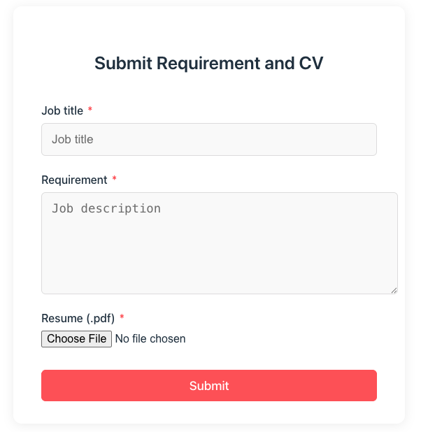
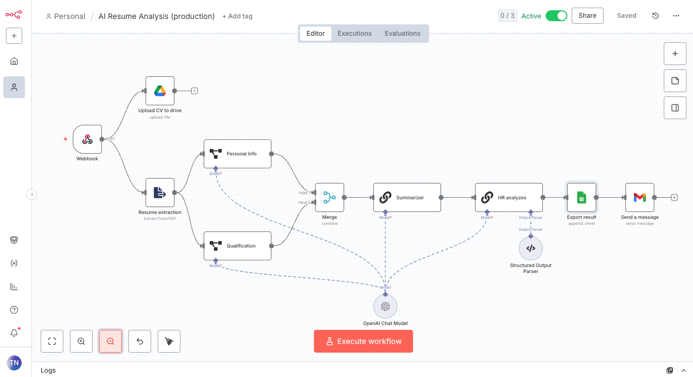

# 🚀 AI-Powered Resume Analysis with n8n

🎥 [Watch Demo Video](public/demo.mp4)

---

## 📌 Overview

This project is a **fully automated AI Resume Screening Tool** built with **n8n**, **OpenAI**, and **Google Workspace integrations**.  

HR teams only need to:
1. Enter the **Job Title**
2. Paste the **Job Requirement**
3. Upload a candidate’s **CV (.pdf)**
4. Click **Submit**

✅ That’s it — the rest is 100% automated.  

The workflow:
- Analyzes the CV content with **AI (OpenAI)**
- Compares candidate skills & experience against job requirements
- Generates an **HR Review Report**
- Uploads the CV to **Google Drive**
- Logs candidate details & AI evaluation into **Google Sheets**
- Sends an **email report** back to HR

---

## ✨ Features

- 📂 Upload CVs via simple web form  
- 🤖 Automatic AI-powered resume analysis  
- 📊 Match score between candidate profile and job requirement  
- ☁️ CV stored safely in Google Drive  
- 📑 Candidate details saved in Google Sheets  
- 📧 Email report sent directly to HR mailbox  

---

## 📩 Contact & Support

For n8n support, or to integrate automated AI agents into your business, please contact me: **bbmcode247@gmail.com**

